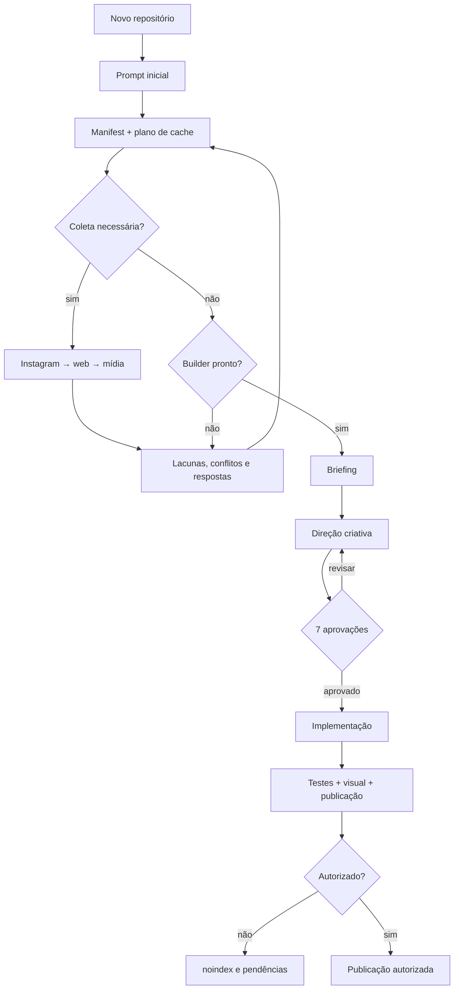

# Landing Page Sample

Este repositório é um **template de demonstração**. A Clínica Aurora, seus contatos, textos e ativos são fictícios/demonstrativos e **não podem ser publicados como um cliente real**. Para iniciar um trabalho, crie outro repositório a partir deste template; mantenha este sample intacto como referência.

## Comece por aqui

1. No GitHub, clique em **Use this template → Create a new repository**. Abra o novo repositório no Codex, Gemini ou Claude, na raiz do projeto.
2. Alternativa por terminal: clone o repositório, remova a origem antiga e configure a do novo projeto (`git remote remove origin` e `git remote add origin <URL>`).
3. Instale os pré-requisitos: Node.js 22, npm, Python 3.10+ e Chrome/Chromium (necessário para o smoke test).
4. Cole o prompt abaixo no agente. Ele iniciará pela skill `landing-page-workflow`.

```text
Use o landing-page-workflow para criar a landing page.

Entidade: [nome oficial]
Site oficial disponível: [URL ou "não"]
Instagram oficial disponível: [URL/@handle ou "não"]
Objetivo principal: [ex.: gerar pedidos de orçamento]
Cache/coleta: [reutilizar cache válido | atualizar tudo | atualizar Instagram | atualizar web | somente dados existentes]

Conduza as perguntas por rodadas, mostre lacunas e conflitos antes de avançar e não publique nem ative serviços externos sem minha autorização explícita.
```

Antes de substituir a demo, a ordem segura é obrigatória: trabalhe na cópia, execute o cleanup em `--dry-run`, confirme a limpeza recuperável, renomeie o pacote/projeto, substitua todos os ativos e só então valide. Exemplo no PowerShell:

```powershell
& '.\.agents\skills\landing-page-builder\scripts\cleanup-sample.bat' --confirm 'Nome do projeto' --dry-run
& '.\.agents\skills\landing-page-builder\scripts\cleanup-sample.bat' --confirm 'Nome do projeto'
```

No Prompt de Comando use `call`; em Linux/macOS use `sh .agents/skills/landing-page-builder/scripts/cleanup-sample.sh`. A limpeza move somente fixtures enumeradas para `.sample-backup/`, portanto é recuperável.

## Visão rápida do fluxo



A jornada detalhada, com rodadas, retornos e gates, está em [Excalidraw](docs/fluxo-nova-landing-page.excalidraw) e [JPG](docs/fluxo-nova-landing-page.jpg).

## O que o agente perguntará

As perguntas são apresentadas em rodadas curtas:

1. **Entrada mínima:** nome da entidade, identificadores públicos, site/Instagram disponíveis, objetivo e modo de cache/refresh.
2. **Fontes oficiais:** confirmação dos perfis e URLs corretos, especialmente quando houver homônimos.
3. **Lacunas e conflitos:** dados ausentes ou divergentes e autorizações para uso de cada mídia, marca ou frase.
4. **Briefing:** oferta, público, diferenciais/provas, contato e uma conversão/CTA principal.
5. **Direção criativa:** arquétipo, narrativa, hero, paleta, tipografia, frase central e mapa de seções.
6. **Aprovação individual:** arquétipo, hero, paleta, tipografia, frase central, seções e CTA — sete decisões, cada uma marcada `aprovado`.
7. **Publicação:** domínio, SEO, formulário, analytics, responsáveis e autorização final.

Se uma coleta ficar `partial`, vencida ou falhar, ou existir conflito material aberto, o fluxo pausa. O agente mostra somente as lacunas, a skill proprietária persiste as respostas no manifest e o workflow recalcula o plano em uma nova rodada. Um plano com intake nunca contém `run_builder`.

## Acompanhar, validar e publicar

O plano é legível por CLI:

```bash
python scripts/manifest.py init nome-da-entidade --display-name "Nome da entidade"
python scripts/workflow.py plan nome-da-entidade
python scripts/workflow.py plan nome-da-entidade --refresh
python scripts/workflow.py plan nome-da-entidade --refresh-instagram
python scripts/workflow.py plan nome-da-entidade --refresh-web
python scripts/workflow.py plan nome-da-entidade --existing-only
python scripts/manifest.py validate nome-da-entidade
```

A saída preserva `actions`, `cache`, `refresh`, `existing_only` e `open_conflicts`, e informa `stage`, `blockers`, `requires_replan` e `builder_ready`. Em `--existing-only`, nenhuma fonte é coletada e todas as pendências são exibidas.

Os três gates têm papéis diferentes:

- `npm test`: integridade técnica, contratos, cinco dry runs, cenários negativos e build.
- `npm run validate:publication`: autorização estratégica; exige briefing e direção criativa reais e aprovados.
- `npm run build`, `npm run preview` e, em outro terminal, `npm run smoke`: inspeção visual automatizada em 390, 768 e 1440 px.

No sample original, `npm run validate:publication` **deve falhar**: não há `requisitos/briefing.md` nem `requisitos/direcao-criativa.md` reais, o site permanece `noindex`, com contatos fictícios e sem briefing aprovado. Uma página tecnicamente válida ainda não está autorizada para publicação.

Domínio, deploy, analytics, formulário, chaves, e-mail e qualquer serviço externo só podem ser ativados com autorização explícita. Os workflows em `.github/workflows/` são referências de CI/deploy; revise secrets e destino antes de habilitar publicação.

## Como o sistema funciona

| Skill | Responsabilidade | Escrita no manifest |
| --- | --- | --- |
| `landing-page-workflow` | Planejar cache, rodadas, bloqueios e handoff | `workflow.*`, `intake_status.media` |
| `instagram-profile-intake` | Perfil/mídia pública oficial e proveniência | `instagram.*`, timestamp/cache/status Instagram |
| `web-profile-intake` | Fatos profissionais, contatos, fontes e conflitos | `web.*`, `contact.*`, conflitos, timestamp/cache/status web |
| `landing-page-builder` | Briefing, direção aprovada, página e gates | `landing_page.*` e artefatos da página |

O builder inclui um preflight visual adaptado da Taste Skill para controlar variância de composição, movimento, densidade e padrões genéricos. A adaptação preserva a stack do sample e fica subordinada aos dados confirmados, às autorizações e aos gates existentes; consulte [avisos de terceiros](docs/third-party-notices.md).

O contrato canônico é `.assets/<entity_id>/manifest.json`, validado por `contracts/manifest.schema.json`. `.assets/` guarda manifest, cache, fontes, raws mínimos, candidatos e logs locais; fica fora do Git. O cache do Instagram vence em 24 horas e o da web em 7 dias. Refresh total ou seletivo invalida o domínio solicitado. Patches atômicos são aplicados com `python scripts/manifest.py patch <entity_id> <owner> <patch.json>`; a CLI recusa campos fora do ownership, caminhos inseguros e documentos integrais.

`intake_status.media = ready` significa **avaliação concluída**, não autorização. Licença, escopo e responsável continuam registrados por ativo. Estados `pending`, `partial`, `stale` e `failed`, conflito aberto ou cache inválido bloqueiam o builder; depois da correção, execute o plano novamente. Falhas de coleta não justificam contornar login, rate limit ou controles de acesso.

Artefatos principais:

```text
.assets/<entity_id>/                  manifest, cache e evidências locais
requisitos/briefing-template.md       contrato para gerar briefing.md
requisitos/direcao-criativa-template.md  contrato para gerar direcao-criativa.md
media/                                instruções para mídias de entrada
public/assets/                        somente ativos autorizados para publicação
src/                                  configuração, JavaScript e estilos
docs/ativos-e-licencas.md             inventário/licenças do sample
```

`briefing.md` e `direcao-criativa.md` são reservados para documentos reais gerados no novo projeto. As dependências de produção da página são GSAP, Lenis e Swiper; Vite e Playwright Core apoiam build e smoke. Nenhuma nova biblioteca é necessária para operar este fluxo.

## Desenvolvimento local

```bash
npm install
npm run dev
```

As fotos atuais são demonstrativas, documentadas em [ativos e licenças](docs/ativos-e-licencas.md); não representam clínica, equipe ou pacientes reais e não implicam endosso.
